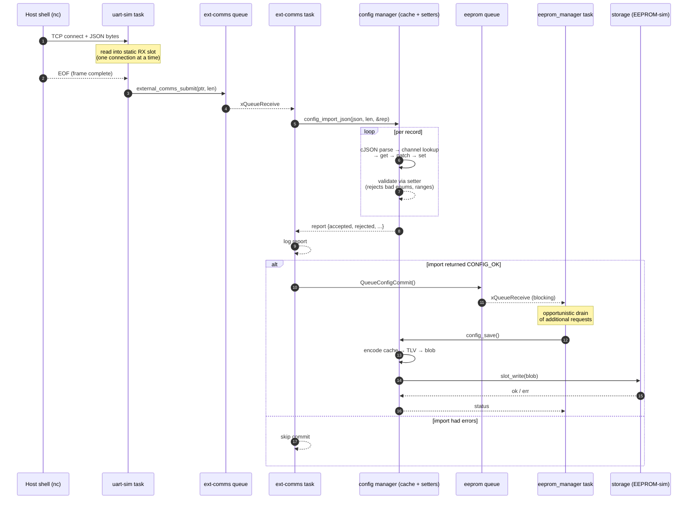
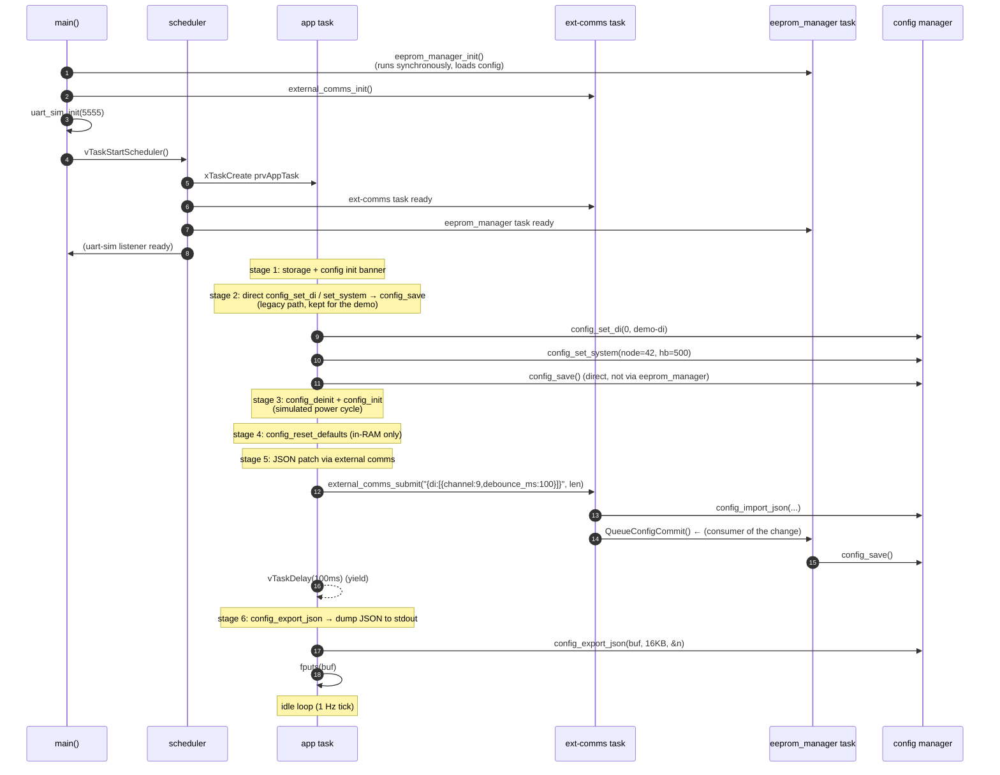

# Runtime architecture

What the system actually looks like once `vTaskStartScheduler()`
returns and the scheduler is running. Companion to
[MODULES.md](MODULES.md) — that file covers the compile-time
dependency graph; this one covers tasks, queues, priorities, and the
end-to-end flow of an operator-submitted JSON patch.

For details inside any one layer (TLV wire format, slot CRC protocol,
JSON wire shape, etc.) see [DESIGN.md](DESIGN.md).

---

## Tasks

| task | priority | stack | source | role |
| --- | --- | --- | --- | --- |
| `app` | `IDLE+1` | `MINIMAL × 2` | `src/main.c` | the demo flow — stages 1–6, then idle tick |
| `ext-comms` | `IDLE+1` | `MINIMAL × 4` | `src/external_comms.c` | drains JSON queue; parses with cJSON; dispatches through `config_set_*`; on success signals the EEPROM manager |
| `uart-sim` | `IDLE+1` | `MINIMAL × 8` | `src/drivers/uart_sim.c` | TCP listener on `:5555`; accepts one connection at a time, reads bytes to EOF into a ring-of-static buffers, hands `{ptr,len}` to `external_comms_submit` |
| `eeprom_manager` | `IDLE+1` | `MINIMAL × 4` | `src/application/eeprom_manager.c` | sole caller of `config_save()`; drains queue and coalesces a burst into one slot write |
| FreeRTOS Idle | idle | `MINIMAL` | kernel | mandatory idle hook |
| FreeRTOS Timer | timer | `configTIMER_TASK_STACK_DEPTH` | kernel | mandatory if timers are used |

All work tasks deliberately share `IDLE+1` in this demo so the host
output stays readable. In a real device the I/O hot-path task (not
yet present) would sit higher; `ext-comms`, `uart-sim`, and
`eeprom_manager` would all live below it.

---

## Queues / IPC

| queue | producer(s) | consumer | depth | payload | back-pressure |
| --- | --- | --- | --- | --- | --- |
| ext-comms queue | `uart-sim`, `app` (demo), tests | `ext-comms` | 4 | `{const char *json; size_t len;}` | `external_comms_submit` returns `false` after 100 ms timeout |
| eeprom manager queue | `ext-comms`, `app` (demo), anything via `QueueConfigChange` | `eeprom_manager` | (see header) | tagged request (commit OR field-update) | non-blocking `false` on full |

Producers carry the buffer-lifetime obligation: the JSON `ptr` must
stay valid until the consumer drains. Long-lived sources (`uart-sim`'s
static RX ring, `app`'s static literal) satisfy this trivially.

---

## Architecture diagram

```mermaid
flowchart LR
    %% ============ Host / outside ============
    host[("Host shell<br/><i>nc -q1 localhost 5555<br/>&lt; examples/config.json</i>")]:::ext

    %% ============ Process boundary ============
    subgraph proc ["config_wp process (FreeRTOS POSIX port)"]
        direction TB

        %% ----- Producers / interface tasks -----
        subgraph if_layer ["Producers"]
            direction LR
            uart["<b>uart-sim task</b><br/><i>TCP :5555<br/>static RX ring × 4</i>"]
            app["<b>app task</b><br/><i>demo, stages 1–6</i>"]
        end

        %% ----- Router -----
        extc["<b>ext-comms task</b><br/><i>cJSON parse →<br/>config_import_json →<br/>QueueConfigCommit</i>"]
        Q1[["ext-comms queue<br/><i>depth 4, {ptr,len}</i>"]]

        %% ----- Manager -----
        subgraph mgr ["Config manager (passive — function calls only)"]
            direction TB
            api["<b>public API</b><br/><i>get/set/import/export</i><br/>validating setters"]
            cache[("<b>s_cache</b><br/>mutex-protected<br/>POD struct")]
            api --- cache
        end

        %% ----- Persistence -----
        Q2[["eeprom queue<br/><i>change OR commit</i>"]]
        eep["<b>eeprom_manager task</b><br/><i>drain + coalesce →<br/>config_save() →<br/>encode → slot_write</i>"]
    end

    %% ----- Storage outside the process boundary -----
    storage[("EEPROM-sim file<br/><i>A/B slots, CRC, seq#</i>")]:::ext

    %% ----- Wire flow -----
    host -- "TCP" --> uart
    uart -- "external_comms_submit" --> Q1
    app  -- "external_comms_submit<br/>(demo stage 5)" --> Q1
    Q1   -- "xQueueReceive" --> extc
    extc -- "config_import_json" --> api
    api  -- "validates + writes" --> cache
    extc -- "QueueConfigCommit" --> Q2
    app  -- "QueueConfigChange<br/>(per-field updates)" --> Q2
    Q2   -- "xQueueReceive" --> eep
    eep  -- "config_save()" --> api
    api  -- "encode → slot bytes" --> storage

    classDef ext fill:#eef,stroke:#557,color:#000
```

The two queues are the only IPC. There is no shared state between
tasks except via the manager's mutex-protected `s_cache`.

---

## Sequence: operator UART → persist

End-to-end path of a single JSON patch arriving over the simulated
UART.

Key invariants enforced by this flow:

| invariant | how it holds |
| --- | --- |
| `config_save()` has exactly one caller | only `eeprom_manager` calls it; documented + grep-able |
| no torn reads of the cache | every set/get takes the manager mutex; struct copy is atomic w.r.t. the lock |
| EEPROM not written per-patch | `eeprom_manager` coalesces drained requests into one save |
| failed imports don't touch storage | `ext-comms` skips `QueueConfigCommit` if `config_import_json` didn't return `CONFIG_OK` |
| RX buffer stays valid past submit | `uart-sim` rotates through a 4-slot static ring sized ≥ ext-comms queue depth |

---

## Sequence: demo (`prvAppTask`) flow

What you see when you run `./build/config_wp` standalone (no `nc` on
the host).

---

## Where to look

| concern | task | source |
| --- | --- | --- |
| "How does a JSON patch get parsed and validated?" | `ext-comms` | [config_json.c](../src/application/config_json.c), [external_comms.c](../src/external_comms.c) |
| "How does a save actually get to flash?" | `eeprom_manager` | [eeprom_manager.c](../src/application/eeprom_manager.c), [config_slot.c](../src/application/config_slot.c) |
| "Where does the UART frame boundary live?" | `uart-sim` | [uart_sim.c](../src/drivers/uart_sim.c) (TCP EOF == frame end) |
| "What ensures atomic reads?" | manager mutex | [config.c](../src/application/config.c), [config_lock_freertos.c](../src/application/config_lock_freertos.c) |
| "Why is there no race between import + save?" | flow ordering | this file's "operator UART → persist" sequence |
