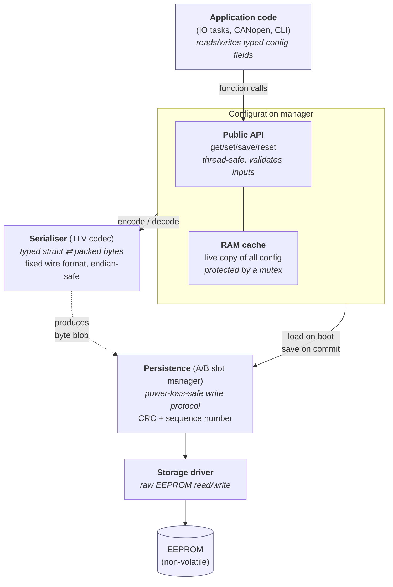
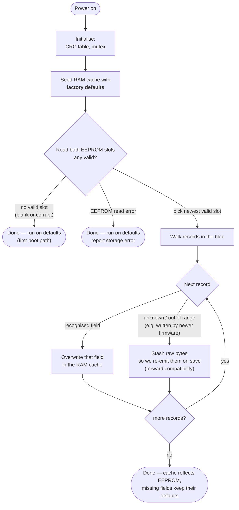
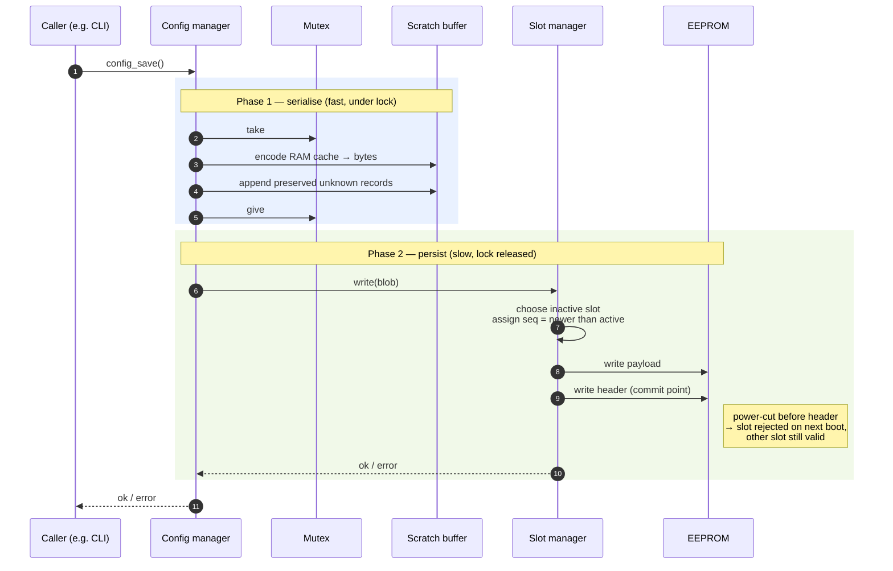
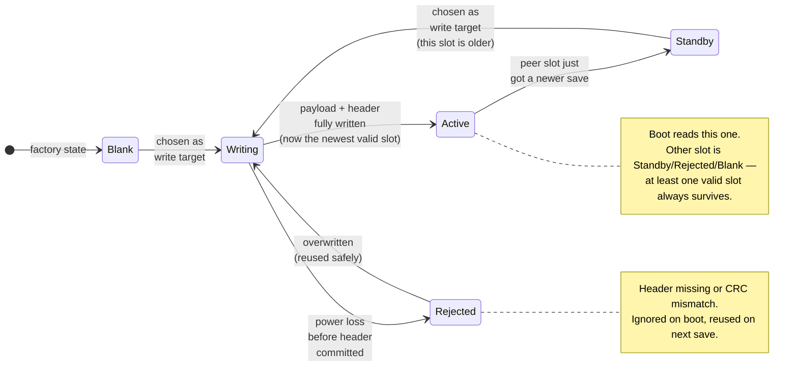

# Design

Design decisions baked into the configuration manager. Sections land as
each layer goes in.

---

## Diagrams

High-level views aimed at readers familiar with embedded systems but
new to this codebase. Detail lives in the per-layer sections below.

### Architecture — layered view

A typical layered embedded stack: each layer talks only to the one
directly below it. Higher layers care about *what* to store, lower
layers about *how* bytes get to the chip.



### Boot flow — loading config from EEPROM

What happens on power-up. The goal: end up with a valid RAM cache no
matter what state the EEPROM is in (blank, corrupted, or holding good
data from a previous run).



### Save flow — committing config to EEPROM

A save must be atomic from the device's point of view: a power cut
mid-write must never leave the device unable to boot. Achieved by
writing to the *other* slot and committing with a header-last write.



### Slot lifecycle — how A/B persistence stays safe

Two identical slots in EEPROM (A and B). At any time at most one is
being written; the other is the safety net. The diagram tracks **one**
slot's perspective. A "newer" slot has a higher monotonic sequence
number than its peer.



---

## Data model

Single source of truth for what configuration looks like in RAM: one
struct per IO channel type (DI, DO, TC, AI, AO, PCNT, PWM), one for
system config, typed enums for constrained fields, and a factory-default
table per type.

```
src/application/
  config_limits.h         channel counts, name length
  config_types.h          enums + structs + io_domain_t
  config_defaults.{h,c}   extern decls + static const tables
```

### Channel counts (`config_limits.h`)

Compile-time `#define`s drawn from the hardware diagram:

| Type | Count | Source |
| ---- | ----: | ------ |
| DI   | 16 | 2 × PCA9555 |
| DO   | 16 | 2 × PCA9555 |
| TC   |  4 | MAX31856 array |
| AI   |  8 | ADC1.IN1..IN8 |
| AO   |  4 | DAC (placeholder) |
| PCNT |  4 | TIM2.CH1..CH4 |
| PWM  |  4 | TIMn.CH1..CH4 |

`CONFIG_NAME_LEN = 16` (15 chars + NUL). Matches CiA 401 device-info
string conventions and fits one TLV record. Defaults tables use array
range-init so bumping a count scales without per-index edits.

### Per-type fields (host sizeof pinned by `tests/test_types.cpp`)

| Type | Fields | sizeof |
| ---- | ------ | ----: |
| `di_config_t`     | name, id, debounce_ms, polarity, fault_state, interrupt_enabled | 32 |
| `do_config_t`     | name, id, polarity, fault_state | 28 |
| `tc_config_t`     | name, id, tc_type, unit, cjc_enabled, filter_ms, fault_state, fault_value_c10 | 40 |
| `ai_config_t`     | name, id, input_mode, filter_ms, scale_num, scale_den, offset, fault_state, fault_value | 48 |
| `ao_config_t`     | name, id, output_mode, slew_per_s, scale_num, scale_den, offset, fault_state, fault_value | 48 |
| `pcnt_config_t`   | name, id, mode, edge, limit, reset_on_read | 36 |
| `pwm_config_t`    | name, id, period_us, duty_permille, fault_state, fault_duty_permille | 36 |
| `system_config_t` | canopen_node_id, can_bitrate, heartbeat_ms, sync_window_us, nmt_startup, producer_emcy_cob_id | 24 |

### Notable field choices

- **`char name[16]`** — fixed-size, no allocator, maps directly to a TLV
  record. Over-long names rejected at the setter boundary.
- **`uint16_t id`** — mirrors CANopen OD index width; one record = one
  `(domain, index)` pair.
- **Integer AI/AO scaling** — `value = (raw * num) / den + offset`
  stored as three `int32_t`. No FPU dependency, deterministic across
  toolchains, maps onto CiA 401 PV factor/offset (0x6126/0x6127).
- **`fault_state_t`** — `HOLD=0`, `LOW=1`, `HIGH=2`. `HOLD` is zero so
  zero-initialised records land in the safe state (pinned by
  `Types.FaultStateHoldIsZero`). Analog types (AI/AO/TC) carry an extra
  `fault_value` field applied when `fault_state != HOLD`.
- **Enums with `_COUNT` sentinel** — range checks read as
  `x.tc_type < TC_TYPE_COUNT` without hard-coding the last legal value.
- **`producer_emcy_cob_id == 0` is a sentinel** — derive `0x80 + node_id`
  at NMT startup; non-zero is an operator override used verbatim. Avoids
  silent staleness when `canopen_node_id` changes later. Same pattern
  generalises to predefined PDO COB-IDs.
- **`io_domain_t`** — stable top-level enum (`DI=0..PWM=6`); append-only
  so older firmware can read newer configs.

### CANopen OD alignment

`system_config_t` field widths match the OD object widths so the
eventual CANopen-stack thread can map cache members directly onto OD
entries without a translation layer:

| field | OD index | width | notes |
| --- | --- | --- | --- |
| `canopen_node_id`        | —      | u8  | LSS bits / addressing; not an OD object itself |
| `can_bitrate`            | —      | enum (u8 on wire) | LSS sub-objects, manufacturer-specific |
| `heartbeat_ms`           | 0x1017 | u16 | Producer Heartbeat Time (ms) |
| `sync_window_us`         | 0x1007 | u32 | Synchronous Window Length (µs) |
| `nmt_startup`            | 0x2xxx | enum | manufacturer-specific |
| `producer_emcy_cob_id`   | 0x1014 | u32 | bit 31 = valid (0)/disabled (1); bit 30 = 11-bit (0)/29-bit (1); bits 28..0 = COB-ID |

IO records follow the same alignment: `name`, `id` (u16 OD index), and
typed-enum fields map onto the CiA 401 generic-I/O object groups. The
hand-rolled `(domain, index)` TLV tag scheme falls one mapping short of
the OD `(index, subindex)` pair — a future codec layer can dispatch tag
→ OD entry directly.

**Gaps from CiA 401 today** (deferred to the writeup roadmap):

- **PDO communication parameters** — OD `0x1400..0x15FF` (RPDO comm),
  `0x1800..0x19FF` (TPDO comm). Each defines a COB-ID, transmission
  type, inhibit time, event timer, and SYNC start value for one PDO.
  CiA 401 mandates four default TPDOs (DI / AI groups) and four
  default RPDOs (DO / AO groups).
- **PDO mapping parameters** — OD `0x1600..0x17FF` (RPDO mapping),
  `0x1A00..0x1BFF` (TPDO mapping). Each defines which OD entries
  (and which bit slices of them) get packed into the PDO's CAN payload.
- **Error behaviour** — OD `0x1029` (Error Behaviour Object) for
  EMCY-handling policy.
- **Identity / device-info objects** — `0x1000`, `0x1008..0x100A`,
  `0x1018` — mostly static, can be compile-time constants rather than
  cache fields.

The natural shape for PDO support is a `pdo_config_t` per PDO and a
`pdo_mapping_t` per PDO, both as arrays inside `system_config_t` (or a
sibling `canopen_pdo_config_t` if size becomes a problem). The TLV
codec / manager already handles arrays of fixed-size records — adding
PDOs is a structural copy of the existing IO record pattern, not new
infrastructure.

### Factory defaults (`config_defaults.{h,c}`)

One `const` table per IO type plus `g_system_defaults`, `extern const`
in the header so every TU sees the same definition and tables stay in
flash. Populated via the gcc/clang range-init extension:

```c
const di_config_t g_di_defaults[CONFIG_NUM_DI] = {
    [0 ... CONFIG_NUM_DI - 1] = { .debounce_ms = 10, ... },
};
```

Not strict ISO C. Suppressed *locally* in `config_defaults.c` only
(`-Wgnu-designator`, `-Wpedantic`) so the rest of the codebase keeps
strict-warning enforcement. Alternatives rejected: per-index spelling
(error-prone — silent zero-fill on forgotten indices); runtime
`config_defaults_init()` (loses `static const` flash placement).

Defaults are exercised on (1) fresh device — both slots blank/corrupt,
(2) explicit `config_reset_defaults()`, (3) per-field when a loaded
record predates a new field. Values are conservative: empty names, ID 0,
`HOLD` for inputs, `LOW` for outputs, 100 ms TC filter, passthrough
scaling, 100 Hz PWM @ 0% duty, CAN 500 kbit/s, node 1, NMT
wait-for-command.

### Modularity

- **More channels** — bump `CONFIG_NUM_*` and rebuild.
- **New IO type** — touch four places: struct in `config_types.h`,
  count in `config_limits.h`, defaults in `config_defaults.c`,
  `IO_DOMAIN_COUNT` in the test. TLV codec and JSON emitter add two
  more once they exist.
- **Board variants** — deferred; a board-variant header overriding
  `CONFIG_NUM_*` is the planned path.

### Non-goals at this layer

No allocation, no I/O, no API, no threading, no persistence. No
CAN-specific wire encoding — `system_config_t` describes *what* the
device should do with CAN, not the OD layout. No active fault detection
— fault-state fields describe *behaviour when a fault is signalled*.

---

## Storage layer

```
src/application/
  crc32.{h,c}         CRC-32/ISO-HDLC, one-shot + streaming API
  config_slot.{h,c}   A/B-slot persistence protocol
```

The slot layer is **type-agnostic** — opaque byte payloads, no
dependency on `config_types.h`. The TLV codec sits between typed config
and this byte-payload interface.

### On-flash layout

```
+-------------------+ offset 0
| Slot A header     | 20 bytes
| Slot A payload    | up to SLOT_PAYLOAD_MAX
+-------------------+ offset SLOT_TOTAL
| Slot B header     |
| Slot B payload    |
+-------------------+
```

Header (`slot_header_t`, packed to 20 bytes, `static_assert`'d):
`magic` (`0xC0FC0FCA`), `format_ver` (=1), `flags` (reserved=0), `seq`
(monotonic per-write counter), `length`, `crc32`. CRC covers
`header[0..crc32) + payload`; CRC field last so it's computed in one
streaming pass.

### Header sanity (before CRC, no payload read)

`slot_header_looks_sane` rejects when: wrong `magic`, wrong
`format_ver` (forces clean break on layout changes — old firmware
refuses new slots and vice versa), non-zero `flags` (reserved for
future use like signed slots), or `length > SLOT_PAYLOAD_MAX`. Cheap
short-circuit on blank/unfamiliar slots. CRC is the final gate.

### Protocol

**Boot — `slot_pick_active(out_id, buf, cap, out_len)`**
1. Read each header.
2. For each sane header, read the payload into `buf` and verify CRC.
3. Both valid → higher `seq` wins. One valid → that one. Neither →
   `SLOT_ERR_NO_VALID` (caller loads defaults).
4. Re-read winner's payload at the end (`buf` is scratch during
   validation).

**Write — `slot_write(payload, len)`**
1. Cheap header scan (no CRC, no payload read). Target the inactive
   slot. `seq = max(sane_seqs) + 1`, starting at 1.
2. Build header in RAM, compute CRC.
3. **Write payload first, then header.** The header is the commit
   record: a torn payload write leaves the slot rejectable on next
   boot via CRC failure; the other slot survives.

### Properties

- **Power-loss safe.** At most one slot corrupted; the other survives
  and is detected via CRC.
- **Bit-flip detection.** Cell flips and torn writes both manifest as
  CRC mismatches (false-negative ~2.3 × 10⁻¹⁰ per record).
- **Newer-wins.** `seq` (`u32`) resolves the both-valid case;
  ~130 years at 1 write/s before wrap.
- **No config-type dependency.** Reusable for any opaque payload.
- **No dynamic allocation.** All RAM caller-provided or stack;
  `crc32` LUT (1 KB) is a single module-local array.
- **Distinguishable errors.** `storage_read` failure returns
  `SLOT_ERR_STORAGE`, not `SLOT_ERR_NO_VALID` — caller separates
  "blank EEPROM" from "broken hardware".

### CRC init contract

`crc32_init()` MUST be called once at single-threaded startup before
any `crc32_compute`/`crc32_step`. No lazy self-init: a racy build of
the 1 KB LUT in a multi-task system is unsafe even though the final
values are deterministic. After init the table is read-only and
concurrent-safe. Debug builds assert on missed init. Test fixtures
call it in `SetUp`; `config_init()` will call it before any task
spawns.

### Out of scope

- **Crypto integrity.** CRC catches accidents, not tampering. If
  signed config is needed later, swap CRC for HMAC-SHA256; protocol
  otherwise unchanged.
- **Sub-record atomicity.** A 2 KB payload spans multiple EEPROM
  pages; torn writes can mix old/new bytes. CRC catches this;
  recovery is "fall back to the other slot," not stitch-together.

---

## TLV codec

Adapter between typed config structs and the opaque byte payload the
slot layer shuttles.

```
src/application/
  tlv.{h,c}           generic Tag-Length-Value iterator + writer
  config_codec.{h,c}  type-aware encoders/decoders + tag conventions
```

`tlv.{h,c}` is type-agnostic; `config_codec.{h,c}` defines how each
struct serialises and which tag identifies each record.

### Record format

```
+--------+--------+----------------------+
|  tag   | length | value (length bytes) |
+--------+--------+----------------------+
 2 bytes  2 bytes    0 .. 65535 bytes
```

Little-endian on the wire. Stream = concatenation of records, no
padding. u16 length caps a record at 64 KiB (largest is 38 bytes;
whole blob < 2 KB).

### Tag encoding

```
bits 15..8   domain   record type
bits  7..0   index    channel within the domain
```

`domain` mirrors `io_domain_t` for IO types; `0xF0` for the singleton
system record. Adding a new IO type adds one `io_domain_t` entry and a
new tag range — existing tags don't move, older firmware skips
unrecognised domains cleanly. Tag space = 65536 records.

### Wire sizes (value bytes; pinned by tests)

| record | bytes | record | bytes |
| --- | ---: | --- | ---: |
| DI | 23 | AO   | 38 |
| DO | 20 | PCNT | 25 |
| TC | 26 | PWM  | 27 |
| AI | 38 | System | 13 |

Wire size is **deliberately decoupled** from `sizeof(struct)`: the
encoder writes field-by-field with explicit widths, so struct padding
and host endianness don't leak into the on-flash representation.
Identical bytes on macOS clang, ARM gcc, or any other toolchain.

### Forward compatibility

1. **Skip unknown records.** Decoder uses `length` to advance past the
   value and continues.
2. **Preserve unknown records on rewrite.** `tlv_writer_emit_raw`
   appends a pre-encoded record verbatim. Higher layers capture
   unknowns on decode and re-emit on encode — byte-for-byte
   round-trip, no silent destruction of config data. Pinned by
   `ConfigCodecForwardCompat.UnknownRecordSurvivesRewrite`.

### Field-level limitation

TLV gives **record-level** forward compat only. Adding a field to
`di_config_t`:

- New firmware reading old records → short bytes → `TLV_ERR_TRUNCATED`
  → manager applies defaults for the record.
- Old firmware reading new records → trailing bytes ignored → new
  fields lost on re-save.

Field-level compat would require nested TLV-within-record. Deferred —
record-level suffices for the common case (adding IO types).

### Why TLV, not Protobuf

| concern | TLV | Protobuf |
| --- | --- | --- |
| Code size | ~200 lines C, no deps | nanopb +10–20 KB ROM + generated code |
| Runtime | one pass/record, u16 + memcpy | varint on every field, more general |
| Build | one `.c`/`.h` | `protoc` toolchain, two sources of truth |
| Field-level fwd compat | no (record-level only) | yes |
| CANopen OD alignment | `(domain, index)` ↔ OD `(index, subindex)` 1:1 | flat field numbers; OD side-table needed |
| Audit posture | every byte traceable to a line | generated code harder to audit |

**TLV is the minimum format that satisfies the README's forward-compat
and piecewise-update requirements.** Protobuf would too, at 10–100×
the code cost. Other formats considered and rejected: CBOR/MessagePack
(too general for a fixed schema), memcpy (no forward compat), DCF text
(blows the EEPROM budget — handled instead by the JSON layer above).

### Test coverage

`tests/test_tlv.cpp` (11 tests): well-formed bytes, sequential append,
`NO_SPACE`/`BUF`/`TRUNCATED`/`OVERRUN` errors, zero-length records,
iterator round-trip, empty buffer returns `TLV_END`, `emit_raw`
round-trip and validation.

`tests/test_config_codec.cpp` (13 tests): wire-size constants per type,
tag round-trip, non-default round-trip per type (8), truncated decode
rejection, name null-termination, unknown record survives a
decode/re-encode round-trip alongside known records.

---

## Extending the schema

The schema is the C code — no `.proto` or YAML. Tests pin every
consistency invariant; failing tests tell you what to update next.

### Adding a field to an existing record

| step | file | change |
| ---- | ---- | --- |
| 1 | `config_types.h` | add struct field |
| 2 | `config_defaults.c` | add default value |
| 3 | `tests/test_types.cpp` | bump sizeof bound if it grew |
| 4 | `config_codec.h` | bump `CONFIG_CODEC_*_WIRE_SIZE` |
| 5 | `config_codec.c` | add `put_*`/`get_*` calls |
| 6 | `tests/test_config_codec.cpp` | exercise new field in round-trip |
| 7 | `docs/DESIGN.md` | update tables |

Steps 4–5 must agree; encoder `assert` fires at runtime and
`ConfigCodecSizes.MatchDeclaredConstants` catches it in test.

### Adding a new IO type (e.g. RTD)

All of the above, plus: `CONFIG_NUM_RTD` in `config_limits.h`; append
`IO_DOMAIN_RTD` to `io_domain_t` (append-only — existing values stay
stable); bump `IO_DOMAIN_COUNT` in `test_types.cpp`; define
`CONFIG_CODEC_DOMAIN_RTD` and wire size in `config_codec.h`; (future)
JSON emitter/parser. Cost asymmetry — 6 files for a field vs 12 for a
type — is the explicit reason cross-language tooling would push us
toward a generator.

### Drift-prevention tests

| invariant | test |
| --- | --- |
| Wire size matches header constant | `ConfigCodecSizes.MatchDeclaredConstants` |
| Encode/decode agree on order/width | `ConfigCodecRoundTrip.*` per type |
| Struct didn't silently bloat | `Types.StructSizesWithinBudget` |
| Defaults in-range | `Defaults.{Di,Do,...}TableIsSane` |
| Enum size stable under `-fshort-enums` | `static_assert` per enum |
| `IO_DOMAIN_COUNT` matches type count | `Types.IoDomainMatchesChannelTypeCount` |
| `FAULT_STATE_HOLD == 0` | `Types.FaultStateHoldIsZero` |
| Unknown records survive round-trip | `ConfigCodecForwardCompat.UnknownRecordSurvivesRewrite` |

The moment a "tests pass but field X is wrong on the wire" failure
appears, we've lost the no-drift guarantee — that's the trigger for
moving to automation.

---

## Manager API and threading

```
src/application/
  config.{h,c}             public API + cache + save/load
  config_lock.h            abstract mutex
  config_lock_freertos.c   FreeRTOS impl (BUILD_APP=ON)
  config_lock_pthread.c    pthread impl (host tests)
```

Single layer callers touch. Public API is 16 getter/setter pairs +
`config_init` / `config_save` / `config_reset_defaults` /
`config_deinit`.

### Module state

| symbol | purpose | size |
| --- | --- | --- |
| `s_cache`        | POD: 7 IO arrays + `system_config_t` | ~2 KB |
| `s_unknown[]`    | raw bytes of TLV records init didn't recognise; re-emitted by save | 1 KB |
| `s_blob_buf[]`   | scratch for slot read on init / encode on save | `SLOT_PAYLOAD_MAX_BYTES` |
| `s_initialised`  | guard: every public call short-circuits with `CONFIG_ERR_NOT_INITIALISED` if false | bool |
| `config_lock`    | mutex protecting `s_cache` and `s_unknown` (non-recursive) | — |

### Lock abstraction

Four functions: `config_lock_create / take / give / destroy`. Same
`.h`, two `.c` impls, CMake picks one. Manager code is byte-identical
across both builds. FreeRTOS impl uses `xSemaphoreCreateMutex` (priority
inheritance); pthread impl wraps `pthread_mutex_t`.

### Concurrency contract

- **Many readers, many setters** — all serialised by the mutex.
- **`config_save` is single-writer** — caller contract; in the FW
  architecture only the EEPROM Manager calls it. `s_blob_buf` is owned
  by the in-flight save until `slot_write` returns.
- **Mutex is NEVER held across `slot_write`** — encode under lock,
  release, write outside. Lock-hold time is a memcpy (µs) not an SPI
  transaction (ms); the IO task can read config between page writes.
  This is the most important threading discipline in the manager.
- **Non-recursive** — public API must not call public API while
  holding the lock. Internal `*_locked` helpers handle the
  already-locked path.

### Lifecycle

**`config_init`** — `crc32_init` → `config_lock_create` → load
defaults → mark initialised → `slot_pick_active`:
- `SLOT_OK` → decode blob, known tags into `s_cache`, unknown tags
  into `s_unknown`
- `SLOT_ERR_NO_VALID` → defaults stand, return OK
- `SLOT_ERR_STORAGE` → defaults stand, return `CONFIG_ERR_STORAGE`

Idempotent. `config_deinit` forces a reload.

**`config_save`** — encode `s_cache` + `s_unknown` into `s_blob_buf`
under the lock, release lock, `slot_write` outside.

**`config_reset_defaults`** — reload defaults under the lock. Does
NOT persist; call `config_save` to commit.

### Getter/setter shape

Both halves of every pair follow the same template:

```c
get: init-check → null-check → bounds-check → take → copy out → give
set: init-check → null-check → bounds-check → validate → take → copy in → give
```

Validators enforce the data-model rules: enum range via `_COUNT`
sentinels, AI/AO `scale_den != 0`, PWM `duty_permille ≤ 1000`, system
`canopen_node_id in 1..127`, `producer_emcy_cob_id == 0` (sentinel) OR
`>= 0x81` (override), `name` null-termination.

### Unknown-record preservation

The codec is type-agnostic; the manager owns the policy.

- **Init**: records with a known domain *and* in-range index go to
  `s_cache`. Everything else — unknown domain, out-of-range index —
  goes verbatim into `s_unknown` via `tlv_writer_emit`.
- **Save**: known records emitted from `s_cache` via the codec; then
  `s_unknown` is walked as raw bytes and re-emitted via
  `tlv_writer_emit_raw`. Unknown records survive byte-for-byte.

The codec gives forward-compatible *parsing* (skip); the manager gives
forward-compatible *persistence* (round-trip). On `s_unknown` overflow
new records are silently dropped — `s_unknown` is 1 KB, well over the
expected one-or-two future record types.

### Concurrency hardening

The concurrency contract isn't enforced — it's *evidenced*. Two
mechanisms:

1. **`config_lock_is_held_by_current_thread()` + priority-inversion
   assert.** A new helper in `config_lock.h` lets defensive code ask
   "do I hold this lock?". `config_save` calls it right before
   `slot_write`:
   ```c
   config_lock_give();
   assert(!config_lock_is_held_by_current_thread()
          && "config_lock must be released before storage I/O");
   slot_write(s_blob_buf, blob_len);
   ```
   A refactor that left the lock held across the SPI transaction trips
   the assert. The pthread backend uses C11 `_Thread_local` so the
   helper is race-free even under heavy contention; the FreeRTOS
   backend uses a static `TaskHandle_t` (narrow TOCTOU window,
   diagnostic-only, documented in the header).

2. **`tests/test_config_concurrency.cpp` (5 tests).** Two test
   classes:

   | suite | what it pins |
   | --- | --- |
   | `LockStateTest.NotHeldByDefault` | helper returns false on a freshly-created lock |
   | `LockStateTest.HeldOnlyInsideLockedRegion` | true between take/give, false outside |
   | `LockStateTest.NotHeldByOtherThread` | a child thread sees its own state, never the parent's |
   | `ConcurrencyTest.ReadersAndWriterNoTorn` | 4 readers × 1 writer × 2 s; writer stamps the same counter into `id` and `debounce_ms`; readers verify `id == debounce_ms` on every read. Any torn read fails. |
   | `ConcurrencyTest.SaveDoesNotBlockReadersForever` | 4 readers × 1 saver × 2 s; readers must make forward progress while `config_save` is in flight, proving the encode/release/write-outside-lock pattern works. |

   Typical run: ~10⁶ reads, ~10⁵ writes, ~10² saves in 2 seconds.
   Zero torn reads, zero deadlocks, zero priority-inversion asserts.

   CI invocation suggestion: `--gtest_repeat=until-fail:50` on the
   concurrency suites to maximise the chance of catching rare ordering
   hazards. Local validation: 20 consecutive repeats clean.

### Out-of-scope for this layer

The proven property is *no torn reads / no observable lock starvation*.
What we don't claim:

- **No livelock** — a pathological reader storm could in theory delay
  writers indefinitely under priority-inheritance disabled. Not
  observed in tests; not proven.
- **Bounded latency** under priority-inversion. The assert proves the
  *structural* property (lock not held across I/O); the test proves the
  *observable* property (readers make progress). Neither bounds the
  worst-case stall.
- **Correctness under preemption inside `pthread_mutex_lock`** — the
  pthread runtime handles this; we trust it.

## Human-readable layer

```
src/application/
  config_json.{h,c}   JSON wrapper over the manager
examples/
  config.json         hand-written illustrative example
```

External dep: cJSON v1.7.18 via `FetchContent` (root `CMakeLists.txt`).
Built static, linked into `application`. Heap-using parser — intended
for the External Comms / CLI thread, **not** the IO hot path.

### Wire shape

```
{
  "format": 2,
  "system": { canopen_node_id, can_bitrate, heartbeat_ms,
              sync_window_us, nmt_startup, producer_emcy_cob_id },
  "di":   [ { "channel": 0, ... }, { "channel": 5, ... } ],
  "do":   [ ... ],
  "tc":   [ ... ],
  "ai":   [ ... ],
  "ao":   [ ... ],
  "pcnt": [ ... ],
  "pwm":  [ ... ]
}
```

Each record carries an explicit `"channel"` field naming the cache
index it targets. Array order is purely presentational — an operator
patching channel 9 ships a one-element array, not a leading-null
prefix. Export emits a dense, ordered array (channels 0..N-1) for
readability. Enums encoded as strings (`"ACTIVE_HIGH"`, `"500K"`);
integer codes also accepted on import for tool friendliness.

### API surface

| symbol | direction | notes |
| --- | --- | --- |
| `config_export_json(buf, cap, *written)` | cache → JSON | dense arrays, always NUL-terminated, `CONFIG_ERR_TOO_LARGE` if `cap` too small |
| `config_import_json(json, len, *report)` | JSON → cache | parses then dispatches each record through the Phase 4 setters; `report` optional |
| `config_import_report_t` | — | `accepted / rejected / unknown_keys / malformed` counters + `first_error[96]` string |

### Import pipeline

```
parse → for each known array:
  seen_mask = 0
  for each entry:
    null              → silent no-op
    not an object     → report->malformed++
    no "channel" int  → report->rejected++ (missing/non-integer channel)
    channel out of    → report->rejected++ (out of range)
      [0, COUNT)
    channel in        → report->rejected++ (duplicate, first wins)
      seen_mask
    else              → mark seen → get cache[ch] → patch → set cache[ch]
```

Set goes through the same validator the C API uses — there is no
second validation path. A bad enum, out-of-range field, or sentinel
violation is rejected by the setter and increments `report->rejected`.

### Sparse / partial semantics

| construct | meaning |
| --- | --- |
| missing top-level key (`"do"` absent) | leave that entire array unchanged |
| empty array (`"di": []`) | no records touched in that array |
| `null` array entry | accepted as a silent no-op (carries no addressing info) |
| missing field inside a record (other than `"channel"`) | keep current cached value for that field |
| unknown top-level key | tolerated, `report->unknown_keys++` |
| unknown field inside a record | silently ignored (patcher only reads keys it knows) |

Lets an operator ship a one-field-of-one-record edit as a single
two-line object — no leading-null padding, no positional gotchas.

### Report struct semantics

- Counters are monotonic across the whole import; the call is **not**
  transactional — accepted records stay applied even if later records
  fail. `config_save` is the commit boundary, separate from import.
- `first_error` captures only the **first** failure (which array,
  which index, which field, what went wrong). Subsequent failures are
  counted but not described — keeps the buffer bounded for the FW
  build.
- Return value: `CONFIG_OK` if JSON parsed (regardless of per-record
  results — check `report->rejected`); `CONFIG_ERR_CODEC` only on
  malformed top-level JSON; `CONFIG_ERR_INVALID` on null input or
  non-object root.

### Addressing contract

Channel is the single source of identity for a record. Four ways a
record can fail to address a cache slot, all rejected with a
descriptive `first_error`:

| failure | example | `first_error` substring |
| --- | --- | --- |
| missing `channel` | `{"debounce_ms": 30}` | `"missing or non-integer 'channel'"` |
| non-integer `channel` | `{"channel": "front_door", ...}` | `"missing or non-integer 'channel'"` |
| out-of-range `channel` | `{"channel": 99, ...}` (only 16 DIs) | `"channel 99 out of range"` |
| duplicate `channel` | two records both `"channel": 3` | `"duplicate channel 3"` |

Duplicate policy is **first wins** — the first record at a given
channel is applied; subsequent duplicates are rejected. This surfaces
operator typos through the report rather than silently last-writes-wins.

### Forward compatibility

Unknown top-level keys (e.g. `"//comment"`, future `"rtd"` array) are
tolerated and counted in `unknown_keys`. Unknown fields inside a
record are silently ignored — the patcher only reads keys it knows
about, so adding a future field name in a JSON file won't break older
firmware. Operators can stash change-log notes via `//*` keys without
affecting import.

### Threading and allocation

cJSON allocates from the C heap via `malloc`/`free`. The IO hot path
must never call import/export — wire this layer into a CLI or
External Comms task with its own heap budget. The underlying
`config_get_*` / `config_set_*` calls are mutex-protected, so import
running concurrently with IO readers is safe; the lock-hold time stays
in microseconds because each setter copies a single record under the
lock and releases.

### Test coverage (`tests/test_config_json.cpp`, 22 tests)

| group | what it pins |
| --- | --- |
| **Export shape** (3) | round-trip-safe JSON; per-record `"channel"` emitted; oversize/null buffers rejected without crash |
| **Round-trip** (1) | `set → export → reset → import → get` reproduces every field across all 7 IO arrays |
| **Single-source validation** (3) | bad enum strings, PWM `duty_permille > 1000`, and `producer_emcy_cob_id == 0x80` are all rejected by the *setter*, not by JSON-specific code |
| **Malformed input** (3) | broken JSON → `CONFIG_ERR_CODEC`; non-object root or `NULL` → `CONFIG_ERR_INVALID` |
| **Addressing contract** (5) | missing channel, non-integer channel, out-of-range channel, duplicate channel (first wins), `null` array entry as silent no-op |
| **Partial update** (3) | one-element JSON patches one channel, leaving other channels untouched; missing fields preserved from cache; out-of-order records still land at the right cache slot |
| **Forward compat / aliases** (3) | unknown top-level key counted, unknown field inside a record silently ignored, integer enum alternative accepted |
| **Report semantics** (1) | first failure is the one captured in `first_error`; later failures only bump the counter |

### Out-of-scope for this layer

- **Schema migration on `format` change** — `format: 2` is the current
  wire version; the import code accepts any number as a no-op for now.
  A future bump will need an explicit migration step before dispatch.
- **Atomic import** — see report-struct semantics above. If atomicity
  is wanted, callers can snapshot via export, attempt import, and
  re-import the snapshot on failure.
- **Streaming / chunked parse** — full document is loaded into cJSON's
  in-memory tree. Sufficient for ≤32 KB blobs; not for arbitrarily
  large inputs.
