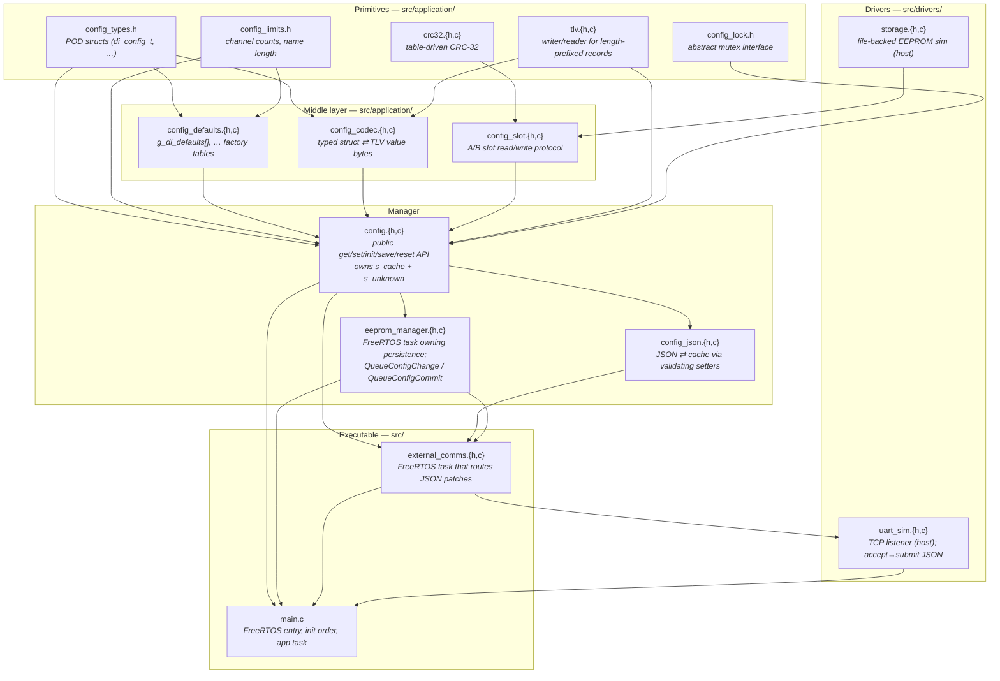

# Module map

Compile-time view of the codebase: which `.c`/`.h` files exist, what
public symbols each module exposes, and which other modules they
depend on at link time. For the *runtime* picture — tasks, queues,
priorities — see [ARCHITECTURE.md](ARCHITECTURE.md).

This file is meant to answer: "if I touch `config_json.c`, what else
might break?" and "where does the cJSON dependency actually live?"

---

## Module dependency graph

Arrow direction: **A → B** means "B includes/uses/depends on A" (A is
linked into B).

---

## Per-module reference

### `src/application/` — config library

| module | public symbols (selection) | depends on (internal) | depends on (external) |
| --- | --- | --- | --- |
| `config_types.h` | `di_config_t`, `do_config_t`, `tc_config_t`, `ai_config_t`, `ao_config_t`, `pcnt_config_t`, `pwm_config_t`, `system_config_t`, enums | — | — |
| `config_limits.h` | `CONFIG_NUM_DI`, …, `CONFIG_NAME_LEN` | — | — |
| `config_defaults.{h,c}` | `g_di_defaults[]`, …, `g_system_defaults` | types, limits | — |
| `crc32.{h,c}` | `crc32_init`, `crc32_compute` | — | — |
| `tlv.{h,c}` | `tlv_writer_init/emit/finish`, `tlv_reader_init/next` | — | — |
| `config_codec.{h,c}` | `config_codec_encode_di/decode_di` (× 7 IO types + system), `config_codec_tag_*` | types, tlv | — |
| `config_slot.{h,c}` | `slot_pick_active`, `slot_write`, `slot_format_t` | crc32, drivers/storage | — |
| `config_lock.h` | `config_lock_create/take/give/destroy`, `config_lock_is_held_by_current_thread` | — | — |
| `config_lock_pthread.c` | (impl of `config_lock.h`) | — | pthread |
| `config_lock_freertos.c` | (impl of `config_lock.h`) | — | FreeRTOS |
| `config.{h,c}` | `config_init/deinit/save/reset_defaults`, `config_get_<type>/set_<type>` × 7 + system | types, limits, defaults, codec, slot, tlv, lock | — |
| `config_json.{h,c}` | `config_export_json`, `config_import_json`, `config_import_report_t` | config, types, limits, defaults | cJSON |
| `eeprom_manager.{h,c}` | `eeprom_manager_init`, `QueueConfigChange`, `QueueConfigCommit` | config | FreeRTOS |

### `src/drivers/`

| module | public symbols | depends on (internal) | depends on (external) |
| --- | --- | --- | --- |
| `storage.{h,c}` | `storage_init`, `storage_read`, `storage_write`, `storage_status_t` | — | — |
| `uart_sim.{h,c}` | `uart_sim_init(port)` | external_comms | FreeRTOS, BSD sockets |

### `src/` — executable level (not in any library)

| module | public symbols | depends on (internal) | depends on (external) |
| --- | --- | --- | --- |
| `main.c` | `main` | config, eeprom_manager, external_comms, drivers/uart_sim, config_print | FreeRTOS |
| `config_print.{h,c}` | `config_print_status`, `config_print_system`, `config_print_di`, `config_print_stage` | config | stdio |
| `external_comms.{h,c}` | `external_comms_init`, `external_comms_submit` | config, config_json, eeprom_manager, config_print | FreeRTOS |

---

## Build artifacts

| target | type | sources | gated by |
| --- | --- | --- | --- |
| `application` | static library | all `src/application/*.c` except one lock impl | always (selects `config_lock_pthread.c` or `_freertos.c` via `BUILD_APP`) |
| `drivers` | static library | `src/drivers/storage.c` | always |
| `config_wp` | executable (FreeRTOS app) | `src/main.c`, `src/config_print.c`, `src/external_comms.c`, `src/drivers/uart_sim.c` | `BUILD_APP=ON` |
| `unit_tests` | executable (host GoogleTest) | `tests/*.cpp` | `BUILD_TESTING=ON` |

`uart_sim.c` and `external_comms.c` are compiled into the *executable*,
not the `drivers` / `application` libraries — keeps host tests free of
FreeRTOS-specific code so they can build with the pthread lock impl.

---

## Layering rules

The graph above is acyclic. Two invariants kept by hand:

1. **`config_save()` has exactly one caller — `eeprom_manager.c`.**
   The header documents it; a grep for `config_save(` outside
   `eeprom_manager.c` should return zero hits.
2. **`config_codec` knows nothing about persistence; `config_slot`
   knows nothing about typed records.** The codec produces TLV bytes;
   the slot manager writes opaque blobs. The manager (`config.c`) is
   the only module that knows both.
